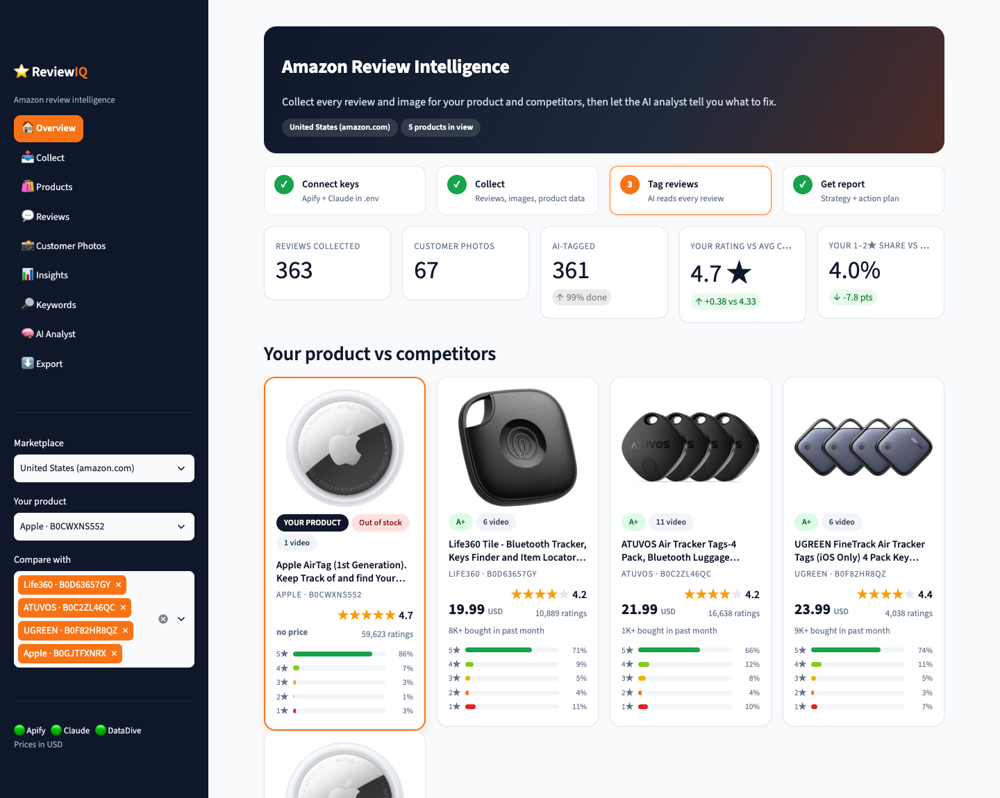
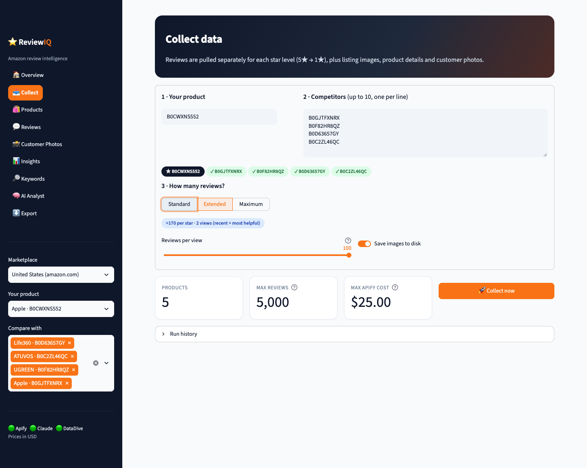
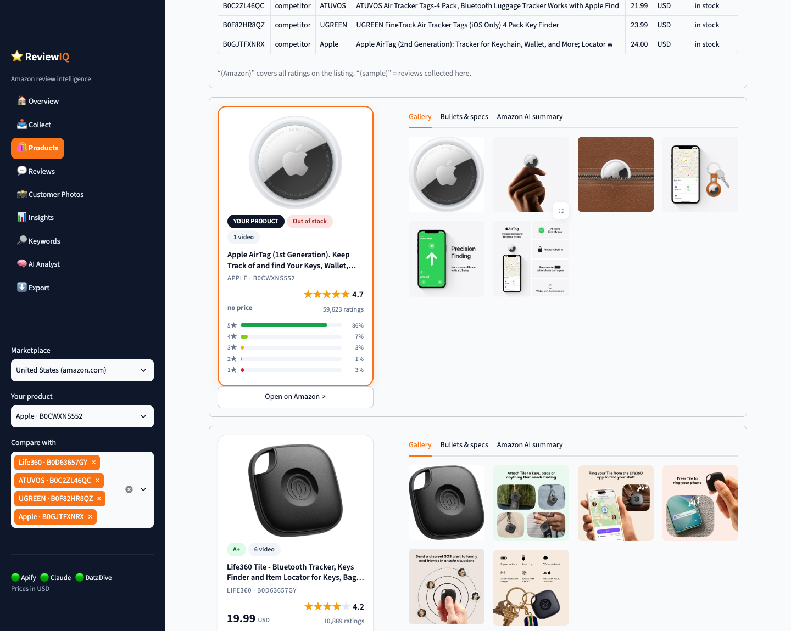
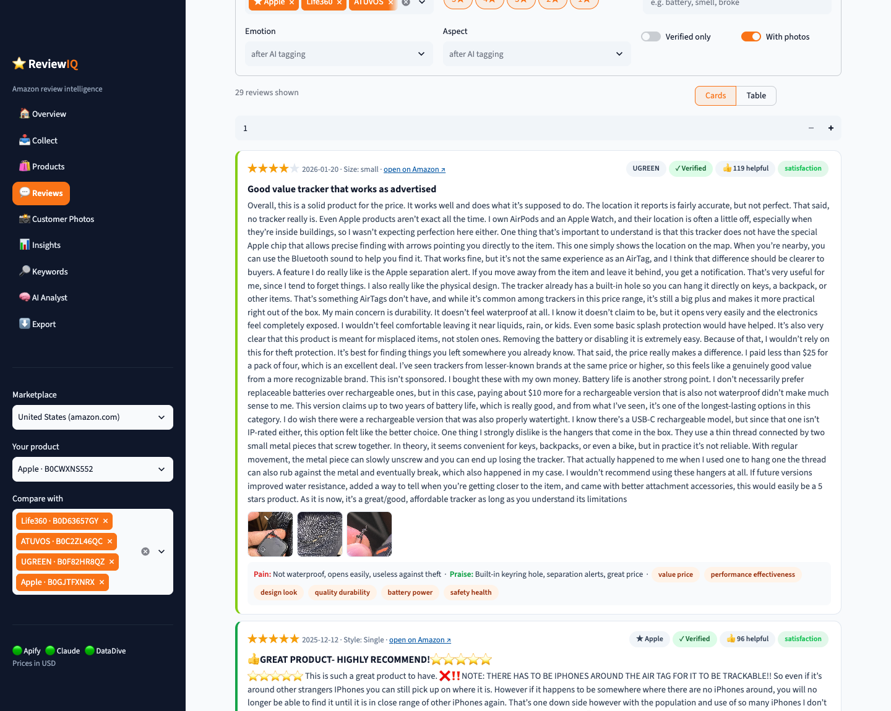
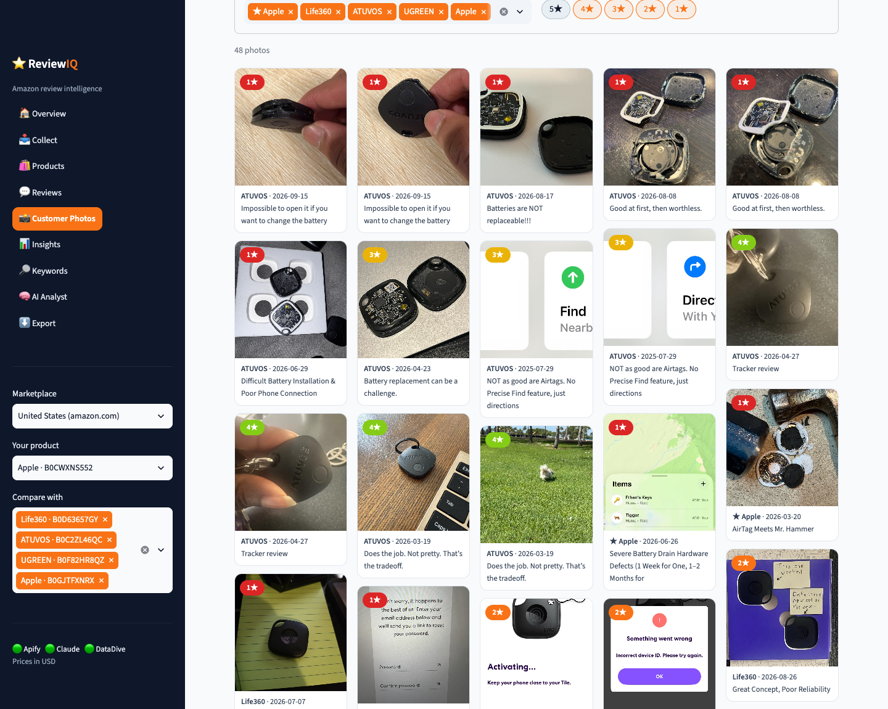
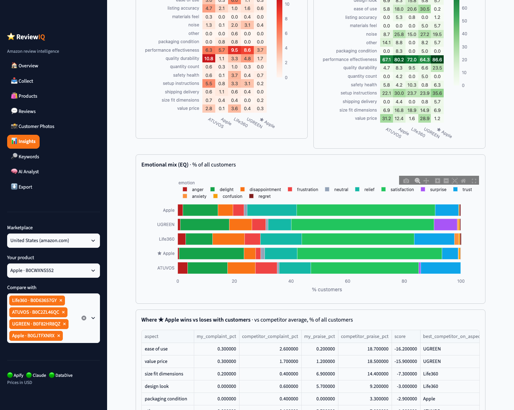
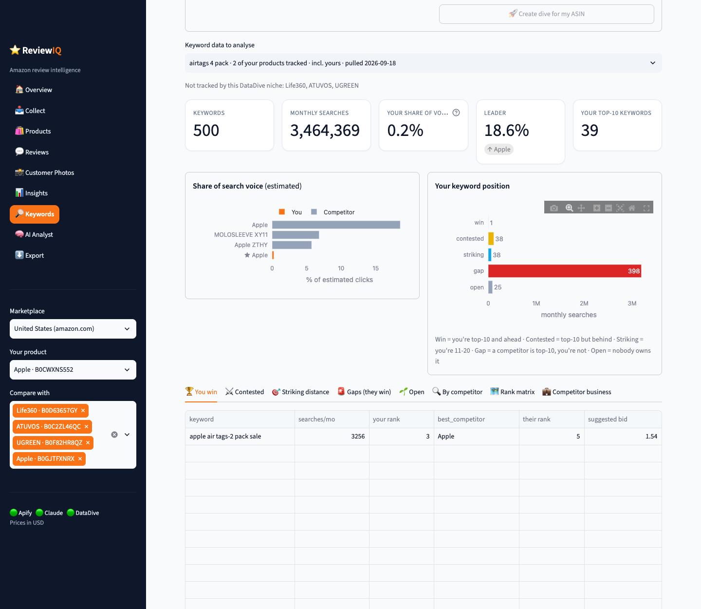
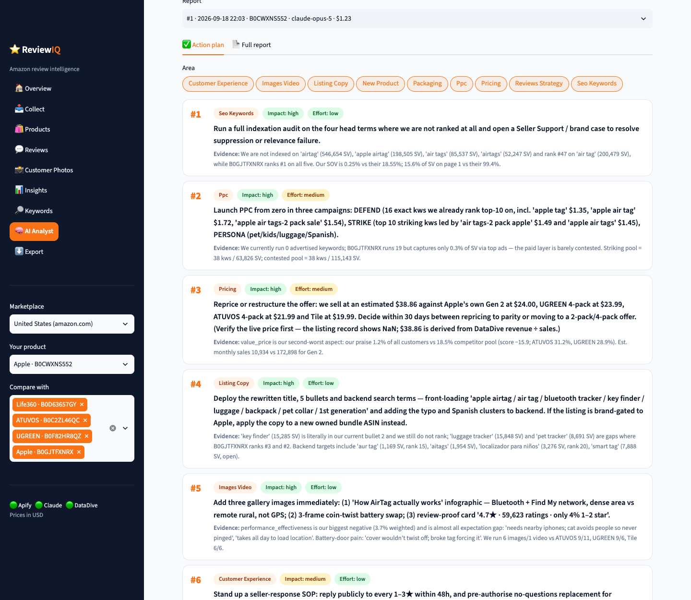
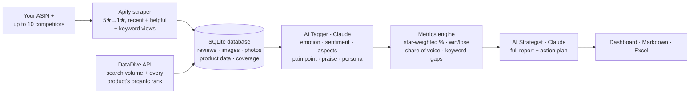

<div align="center">

# ⭐ ReviewIQ

### Amazon review & competitor intelligence, powered by AI

Paste your ASIN and up to 10 competitors. ReviewIQ collects every review, image and customer photo, reads them with an AI analyst, maps who wins which search keyword, and hands you a strategy: **where you win, where you lose, and exactly how to win more.**




</div>

---

## Why ReviewIQ?

Reading hundreds of competitor reviews by hand takes days, and it's easy to miss what matters. Spreadsheet exports don't tell you *why* customers love or hate a product, and keyword tools don't tell you *what to say* to win the click.

ReviewIQ puts both together:

| Without ReviewIQ | With ReviewIQ |
|---|---|
| Skim a few top reviews per product | Every review from 5★ to 1★, for you and 10 competitors, in one database |
| "People seem to complain about quality" | e.g. "12.4% of all customers complain about battery life, vs 3.1% for the best competitor" |
| Guess which keywords to target | See every search term you win, lose, or could win, with volume and suggested bid |
| Generic listing advice | A rewritten title & bullets, a PPC plan, and a 30/60/90-day plan built from real evidence |

**Built for** Amazon brand owners, agencies and product teams who make listing, PPC and product decisions with real money.

---

## What you get

<table>
<tr>
<td width="50%"><br><b>📥 Collect</b> - Enter ASINs or product links. Choose how deep to go (up to ~400+ reviews per star level). See the cost before you start.</td>
<td width="50%"><br><b>🛍️ Products</b> - Side-by-side listings: price, rating, star breakdown, full-size gallery, bullets, specs and Amazon's own AI review summary.</td>
</tr>
<tr>
<td><br><b>💬 Reviews</b> - Every review as a readable card or a table: stars, date, verified, helpful votes, customer photos, plus AI-tagged emotion, pain point and praise.</td>
<td><br><b>📸 Customer photos</b> - A wall of what buyers actually photograph. Low-star photos reveal defects and packaging problems fast.</td>
</tr>
<tr>
<td><br><b>📊 Insights</b> - Complaints & praise by product aspect, emotional mix (EQ), and a <b>win / lose table</b> vs competitors, all weighted to the real star mix.</td>
<td><br><b>🔎 Search keywords</b> - Share of search voice, the keywords you win, the ones competitors win, striking-distance terms and open white space (via DataDive).</td>
</tr>
<tr>
<td colspan="2"><br><b>🧠 AI Analyst</b> - One click produces the full strategy report and a prioritized action plan with impact, effort, timeframe and KPI for every action.</td>
</tr>
</table>

---

## How it works



1. **Collect** - Amazon only shows ~100 reviews per filter view, so ReviewIQ requests several views (each star level × *most recent* and *most helpful*, plus optional keyword searches) and merges them, de-duplicating by review ID. Listing images and customer photos are saved at full resolution.
2. **Store** - Everything goes into a local SQLite database. Re-running never duplicates rows; it updates them.
3. **Tag** - Claude reads every review and tags the dominant emotion, sentiment, product aspects, the specific pain point or praise, use case, buyer persona and purchase driver.
4. **Measure** - Because reviews are sampled evenly per star, raw counts over-represent 1★ reviews. Every "% of customers" figure is **re-weighted by Amazon's real star breakdown**, so the numbers reflect the whole customer base.
5. **Keywords** - DataDive supplies the niche's search terms with volume, suggested bid and each product's organic rank. ReviewIQ classifies every keyword (win · contested · striking distance · gap · open) and estimates share of search voice.
6. **Strategize** - A second Claude pass reads only computed evidence (so numbers are quoted, not invented) and writes the report.

### The strategy report

📄 **[Read a full sample report →](docs/sample-report.md)** (Apple AirTag vs 4 competitors)

| # | Section | What it answers |
|---|---|---|
| 1 | Executive summary | Where you win, where you lose, the biggest opportunity, the #1 move |
| 2 | Market snapshot | Price, rating, sales, listing assets for every product |
| 3 | **Where we win vs lose with customers** | Per aspect: your complaint & praise rate vs competitors, with quotes |
| 4 | Customer emotional intelligence (EQ) | What triggers delight vs frustration, and the emotional job the product is hired for |
| 5 | Pain-point deep dive | Root causes; product defects vs expectation gaps |
| 6 | **Search keyword battlefield** | Share of voice, keywords you own, keywords each competitor pulls, gaps, white space |
| 7 | **Where we can win** | Rewritten title & bullets, PPC plan with bids, messaging that exploits competitor weaknesses, product fixes |
| 8 | 30/60/90-day plan | Actions with KPIs and targets |
| 9 | Risks & data limits | What to watch and how confident to be |

---

## Quick start

**Requirements:** macOS or Linux, [uv](https://docs.astral.sh/uv/), and API keys for [Apify](https://console.apify.com/settings/integrations) and [Anthropic](https://console.anthropic.com/settings/keys). [DataDive](https://2.datadive.tools/api-key) is optional (needed for search keywords; Standard or Enterprise plan).

```bash
git clone https://github.com/Only-Pro-Marketer/Review-IQ.git
cd Review-IQ
cp .env.example .env      # then paste your keys into .env
./run.sh                  # installs everything on first run, then opens the dashboard
```

Open **http://localhost:8501**.

### Using it

1. **Collect** - pick the marketplace, enter your ASIN and competitors, choose a depth, click **Collect now**.
2. **Keywords** - *Find my niches in DataDive* → *Pull keywords* (or create a new dive seeded with your ASIN).
3. **AI Analyst** - *Tag reviews*, then *Write full analysis report*.
4. **Export** - Excel workbook (15+ sheets), reviews CSV, or the report as Markdown.

---

## Costs (pay-as-you-go, USD)

| Step | Typical cost |
|---|---|
| Reviews (Apify, ~$0.005 per review) | Standard: ≤ $27.50 for 11 products · Extended: ≤ $55 · usually 30–60% less in practice |
| AI tagging (Claude Opus 5) | ≈ $1.50–2.00 per 1,000 reviews |
| Strategy report | ≈ $1–3 |
| DataDive keywords | Uses your DataDive plan (a new dive costs ~1 token per competitor) |

The app shows an estimate before every paid step. You can switch the analyst to Claude Sonnet 5 to cut AI costs.

---

## Data accuracy

- **Review coverage** - Amazon exposes ~100 reviews per filter view. *Extended* depth (recent + helpful) gets ~170 per star; *Maximum* adds keyword searches (measured 400+ per star). The **Coverage** table shows collected vs available for every star, so partial data is never hidden.
- **Weighted percentages** - "% of customers" is re-weighted by Amazon's star mix. Figures marked "(sample)" are not.
- **Share of voice** - uses an estimated click-through curve by organic position. Treat it as directional.
- **Currency** - prices are shown in the marketplace currency. Never compare marketplaces without converting.

---

## Privacy & security

- API keys live only in your local `.env`, which is git-ignored. Nothing is sent anywhere except the three APIs you configure.
- Your database, downloaded images and reports stay on your machine (`data/` is git-ignored).
- Reviewer names and profile IDs are **not** collected (`includeGdprSensitive: false`).
- Test fixtures contain anonymized sample data only.

---

## Project structure

```
app.py                    Streamlit dashboard (9 pages)
review_intel/
  apify.py                Apify client: multi-view collection, retries, pagination
  parse.py                Raw scraper output → clean records (full-size photos, dates, votes)
  db.py                   SQLite schema + idempotent upserts
  metrics.py              Coverage, star re-weighting, trends, aspect & emotion prevalence
  keywords.py             Keyword battlefield, share of voice, customer win/lose
  datadive.py             DataDive API client
  analyst.py              AI tagger + strategist (Claude, structured JSON output)
  images.py · export.py   Image downloads · Excel export
  ui.py                   Theme and visual components
tests/                    54 tests (parsing, storage, math, API clients, every UI page)
```

Run the tests:

```bash
.venv/bin/pytest -q
```

---

<div align="center">

Built by <b>Pro Marketer</b> · Not affiliated with Amazon, Apify, Anthropic or DataDive. Use responsibly and in line with each platform's terms.

</div>
